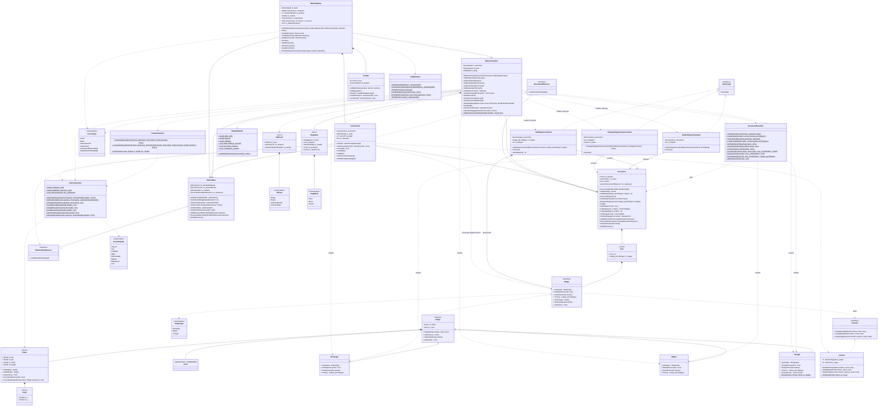

# Диаграммы редактора

## Диаграмма классов

```mermaid
classDiagram
    direction TB

    class Point {
        <<struct>>
        + double m_x
        + double m_y
    }

    class Frame {
        <<struct>>
        + double m_left
        + double m_top
        + double m_width
        + double m_height
        + GetRight() double
        + GetBottom() double
        + GetCenter() Point
        + IsContains(Point point) bool
        + IsContainsFrame(Frame other, double tolerance) bool
    }

    class Color {
<<typedefuint32_t 0xRRGGBB>>
}

class ICanvas {
<<interface>>
+ DrawRectangle(Frame frame, Color color)*
+ DrawEllipse(Frame frame, Color color)*
+ DrawPolygon(vector~Point~ vertices, Color color)*
 }

class ShapeType {
<<enumeration>>
Rectangle
Ellipse
Triangle
 }

class IShape {
<<interface>>
+ GetType() ShapeType*
+ HitTest(Point point) bool*
+ Draw(ICanvas& canvas)*
+ Clone() unique_ptr~IShape~*
+ GetFrame() Frame*
+ SetFrame(Frame frame)*
+ GetColor() Color*
 }

class Shape {
<<abstract>>
- Frame m_frame
- Color m_color
+ Shape(Frame frame, Color color)
+ GetFrame() Frame
+ SetFrame(Frame frame)
+ GetColor() Color
}

class Rectangle {
+ GetType() ShapeType
+ HitTest(Point point) bool
+ Draw(ICanvas& canvas)
+ Clone() unique_ptr~IShape~
 }

class Ellipse {
+ GetType() ShapeType
+ HitTest(Point point) bool
+ Draw(ICanvas& canvas)
+ Clone() unique_ptr~IShape~
 }

class Triangle {
+ GetType() ShapeType
+ HitTest(Point point) bool
+ Draw(ICanvas& canvas)
+ Clone() unique_ptr~IShape~
+ GetVertices() vector~Point~
- Cross(Point a, Point b, Point c)$ double
}

class IDocumentObserver {
<<interface>>
+ OnDocumentChanged()*
 }

class Document {
- Frame m_bounds
- vector~Item~ m_items
- int m_nextId
- vector~IDocumentObserver*~ m_observers
+ Document(double width, double height)
+ GetBounds() Frame
+ AddShape(unique_ptr~IShape~ shape) int
+ RemoveShape(int id)
+ SetShapeFrame(int id, Frame frame)
+ ReplaceShapes(vector~unique_ptr~IShape~~ shapes)
+ Clear()
+ GetShapeCount() size_t
+ GetShape(size_t index) const IShape&
+ GetShapeId(size_t index) int
+ FindShape(int id) const IShape*
+ FindTopShape(Point point) optional~int~
+ AddObserver(IDocumentObserver& observer)
+ RemoveObserver(IDocumentObserver& observer)
- CheckFrame(Frame frame)
- NotifyObservers()
}

class Item {
<<struct>>
+ int m_id
+ unique_ptr~IShape~ m_shape
}

class DocumentSerializer {
+ Save(Document document, ostream& output)$
+ Load(istream& input)$ vector~unique_ptr~IShape~~
+ SaveToFile(Document document, path path)$
+ LoadFromFile(path path)$ vector~unique_ptr~IShape~~
- GetTypeName(ShapeType type)$ string
- IsSupportedTypeName(string name)$ bool
- LinePrefix(size_t lineNumber)$ string
- ParseNumber(string token, string name, size_t lineNumber)$ double
- ParseColor(string token, size_t lineNumber)$ Color
- ParseShape(string line, size_t lineNumber)$ unique_ptr~IShape~
- IsEmptyLine(string line)$ bool
}

class IEditorStateObserver {
<<interface>>
+ OnEditorStateChanged()*
 }

class EditorState {
- optional~int~ m_selectedShapeId
- optional~Frame~ m_previewFrame
- optional~path~ m_filePath
- vector~IEditorStateObserver*~ m_observers
+ GetSelectedShapeId() optional~int~
+ SetSelectedShapeId(optional~int~ id)
+ GetPreviewFrame() optional~Frame~
+ SetPreviewFrame(optional~Frame~ frame)
+ GetFilePath() optional~path~
+ SetFilePath(optional~path~ path)
+ AddObserver(IEditorStateObserver& observer)
+ RemoveObserver(IEditorStateObserver& observer)
- NotifyObservers()
}

class ResizeHandle {
<<enumeration>>
TopLeft
Top
TopRight
Right
BottomRight
Bottom
BottomLeft
Left
 }

class SelectionFrame {
+ double HANDLE_SIZE$
+ double BORDER_SELECT_SIZE$
+ array~ResizeHandle~ ALL_HANDLES$
+ GetHandleFrame(Frame selection, ResizeHandle handle)$ Frame
+ HitTestHandle(Frame selection, Point point)$ optional~ResizeHandle~
+ HitTestBorder(Frame selection, Point point)$ bool
+ IsLeftMove(ResizeHandle handle)$ bool
+ IsRightMove(ResizeHandle handle)$ bool
+ IsTopMove(ResizeHandle handle)$ bool
+ IsBottomMove(ResizeHandle handle)$ bool
- GetHandleCenter(Frame selection, ResizeHandle handle)$ Point
}

class CursorType {
<<enumeration>>
Arrow
Move
SizeHorizontal
SizeVertical
SizeTopLeftBottomRight
SizeBottomLeftTopRight
}

class EditorController {
- Document& m_document
- EditorState& m_state
- DragState m_drag
+ EditorController(Document& document, EditorState& state)
+ AddShape(ShapeType type)
+ DeleteSelectedShape()
+ OnMouseDown(Point point)
+ OnMouseMove(Point point)
+ OnMouseUp(Point point)
+ HitTest(Point point) HitResult
+ GetCursorType(Point point) CursorType
+ NewDocument()
+ SaveDocument(path path)
+ OpenDocument(path path)
- StartDrag(DragMode mode, int id, Point point, ResizeHandle handle)
- ResetDrag()
- GetSelectedFrame() optional~Frame~
- CalculateDraggedFrame(Point point) Frame
- GetResizeCursor(ResizeHandle handle)$ CursorType
}

class HitResult {
<<struct>>
+ HitArea m_area
+ optional~int~ m_shapeId
+ optional~ResizeHandle~ m_handle
}

class HitArea {
<<enumeration>>
Empty
Shape
SelectionBorder
ResizeHandle
}

class DragMode {
<<enumeration>>
None
Move
Resize
 }

class DragState {
<<struct>>
+ DragMode m_mode
+ int m_shapeId
+ ResizeHandle m_handle
+ Point m_startPoint
+ Frame m_startFrame
}

class FrameCalculator {
+ CalculateMovedFrame(Frame startFrame, Point offset, Frame bounds)$ Frame
+ CalculateResizedFrame(Frame startFrame, ResizeHandle handle, Point offset, Frame bounds, double minSize)$ Frame
- Clamp(double value, double lo, double hi)$ double
}

class ShapeDefaults {
+ double MIN_SIZE$
+ double WIDTH$
+ double HEIGHT$
+ Color RECTANGLE_COLOR$
+ Color ELLIPSE_COLOR$
+ Color TRIANGLE_COLOR$
+ GetDefaultFrame(Frame bounds)$ Frame
}

class ICommand {
<<interface>>
+ Execute()*
 }

class AddShapeCommand {
- Document& m_document
- unique_ptr~IShape~ m_shape
- int m_shapeId
+ AddShapeCommand(Document& document, unique_ptr~IShape~ shape)
+ Execute()
+ GetShapeId() int
}

class DeleteShapeCommand {
- Document& m_document
- int m_shapeId
+ DeleteShapeCommand(Document& document, int shapeId)
+ Execute()
}

class ChangeShapeFrameCommand {
- Document& m_document
- int m_shapeId
- Frame m_frame
+ ChangeShapeFrameCommand(Document& document, int shapeId, Frame frame)
+ Execute()
 }

class Canvas {
- sf:: RenderTarget& m_target
- sf:: Vector2f m_origin
+ DrawRectangle(Frame frame, Color color)
+ DrawEllipse(Frame frame, Color color)
+ DrawPolygon(vector~Point~ vertices, Color color)
+ ToSfColor(Color color)$ sf:: Color
}

class CanvasView {
- Document& m_document
- EditorState& m_state
- sf:: Vector2f m_origin
- bool m_isInvalid
+ Draw(sf:: RenderTarget& target)
+ ToDocumentPoint(sf:: Vector2f point) Point
+ IsInvalid() bool
+ Invalidate()
+ Validate()
+ OnDocumentChanged()
+ OnEditorStateChanged()
}

class Toolbar {
- sf:: Font m_font
- vector~Button~ m_buttons
+ AddButton(string label, function onClick)
+ AddSeparator()
+ Draw(sf:: RenderTarget& target)
+ HandleClick(sf:: Vector2f point) bool
+ Contains(sf:: Vector2f point) bool
}

class FileWindows {
+ ShowOpenFileDialog()$ optional~path~
+ ShowSaveFileDialog(string defaultName)$ optional~path~
+ ShowError(string message)$
- QuoteShellArgument(string text)$ string
- RunAppleScript(string script, string argument)$ string
- ToPath(string output)$ optional~path~
}

class EditorWindow {
- EditorState& m_state
- EditorController& m_controller
- sf:: RenderWindow m_window
- Toolbar m_toolbar
- CanvasView m_canvasView
- map~CursorType, sf::Cursor~ m_cursors
- bool m_isMousePressed
+ EditorWindow(Document& document, EditorState& state, EditorController& controller)
+ Run()
- HandleEvent(sf:: Event event)
- HandleKeyPressed(KeyPressed key)
- UpdateCursor(sf:: Vector2f point)
- Render()
- NewDocument()
- OpenDocument()
- SaveDocument()
- RunFileOperation(string errorMessage, function operation)
}

Frame *-- Point
IShape <|.. Shape
Shape <|-- Rectangle
Shape <|-- Ellipse
Shape <|-- Triangle
Shape *-- Frame
Shape *-- Color
IShape ..> ShapeType
IShape ..> ICanvas: Draw

Document *-- "0..*" Item
Item *-- "1" IShape
Document o-- "0..*" IDocumentObserver
DocumentSerializer ..> Document: Save
DocumentSerializer ..> Rectangle: creates
DocumentSerializer ..> Ellipse: creates
DocumentSerializer ..> Triangle: creates

EditorState o-- "0..*" IEditorStateObserver
SelectionFrame ..> ResizeHandle
SelectionFrame ..> Frame

ICommand <|.. AddShapeCommand
ICommand <|.. DeleteShapeCommand
ICommand <|.. ChangeShapeFrameCommand
AddShapeCommand --> Document: receiver
DeleteShapeCommand --> Document: receiver
ChangeShapeFrameCommand --> Document: receiver
AddShapeCommand *-- IShape: до Execute

EditorController --> Document
EditorController --> EditorState
EditorController *-- DragState
EditorController ..> HitResult
HitResult *-- HitArea
DragState *-- DragMode
EditorController ..> FrameCalculator
EditorController ..> ShapeDefaults
FrameCalculator ..> SelectionFrame
EditorController ..> SelectionFrame
EditorController ..> AddShapeCommand: creates, Execute
EditorController ..> DeleteShapeCommand: creates, Execute
EditorController ..> ChangeShapeFrameCommand: creates, Execute
EditorController ..> Rectangle: creates
EditorController ..> Ellipse: creates
EditorController ..> Triangle: creates
EditorController ..> DocumentSerializer
EditorController ..> CursorType

ICanvas <|.. Canvas
IDocumentObserver <|.. CanvasView
IEditorStateObserver <|.. CanvasView
CanvasView --> Document
CanvasView --> EditorState
CanvasView ..> Canvas
CanvasView ..> SelectionFrame
CanvasView ..> IShape: Clone для превью жеста
EditorWindow *-- CanvasView
EditorWindow *-- Toolbar
EditorWindow --> EditorController
EditorWindow --> EditorState
EditorWindow ..> FileWindows
EditorWindow ..> CursorType
```