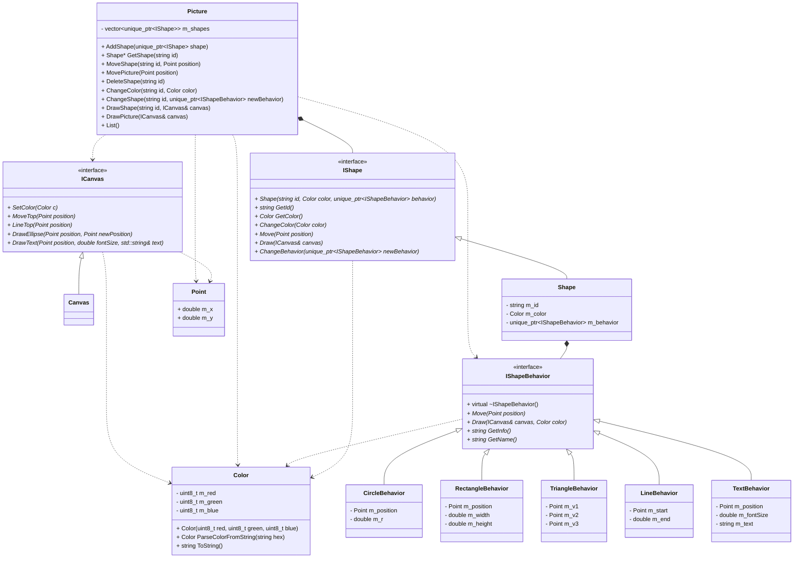

```mermaid
classDiagram
    class Color {
        - uint8_t m_red
        - uint8_t m_green
        - uint8_t m_blue
        
        + Color(uint8_t red, uint8_t green, uint8_t blue)
        + Color ParseColorFromString(string hex)
        + string ToString()
      }
    
      class ICanvas {
          <<interface>>
          + SetColor(Color c)*
          + MoveTop(Point position)*
          + LineTop(Point position)*
          + DrawEllipse(Point position, Point newPosition)*
          + DrawText(Point position, double fontSize, std::string& text)*
      }
    
      class IShapeBehavior {
          <<interface>>
          + virtual ~IShapeBehavior()
          + Move(Point position)*
          + Draw(ICanvas& canvas, Color color)*
          + string GetInfo()*
          + string GetName()*
      }
    
      class IShape {
          <<interface>>
          + Shape(string id, Color color, unique_ptr~IShapeBehavior~ behavior)*
          + string GetId()*
          + Color GetColor()*
          + ChangeColor(Color color)*
          + Move(Point position)*
          + Draw(ICanvas& canvas)*
          + ChangeBehavior(unique_ptr~IShapeBehavior~ newBehavior)*
      }
    
      class Canvas {
      }
    
      class Shape {
          - string m_id
          - Color m_color
          - unique_ptr~IShapeBehavior~ m_behavior
      }
    
      class Picture {
          - vector~unique_ptr~IShape~~ m_shapes
          + AddShape(unique_ptr~IShape~ shape)
          + Shape* GetShape(string id)
          + MoveShape(string id, Point position)
          + MovePicture(Point position)
          + DeleteShape(string id)
          + ChangeColor(string id, Color color)
          + ChangeShape(string id, unique_ptr~IShapeBehavior~ newBehavior)
          + DrawShape(string id, ICanvas& canvas)
          + DrawPicture(ICanvas& canvas)
          + List()
      }
    
      class CircleBehavior {
          - Point m_position
          - double m_r
      }
    
      class RectangleBehavior {
          - Point m_position
          - double m_width
          - double m_height
      }
    
      class TriangleBehavior {
          - Point m_v1
          - Point m_v2
          - Point m_v3
      }
    
      class LineBehavior {
          - Point m_start
          - double m_end
      }
    
      class TextBehavior {
          - Point m_position
          - double m_fontSize
          - string m_text
      }
    
      class Point {
          + double m_x
          + double m_y
      }
    
      ICanvas ..> Color
      Picture ..> ICanvas
      Picture ..> Color
      Picture ..> IShapeBehavior
      IShapeBehavior ..> Color
      IShape ..> Color
    
      Shape *-- IShapeBehavior
      Picture *-- IShape
      IShape <|-- Shape
      ICanvas <|-- Canvas
    
      IShapeBehavior <|-- CircleBehavior
      IShapeBehavior <|-- RectangleBehavior
      IShapeBehavior <|-- TriangleBehavior
      IShapeBehavior <|-- LineBehavior
      IShapeBehavior <|-- TextBehavior
    
      Picture ..> Point
      ICanvas ..> Point
```
